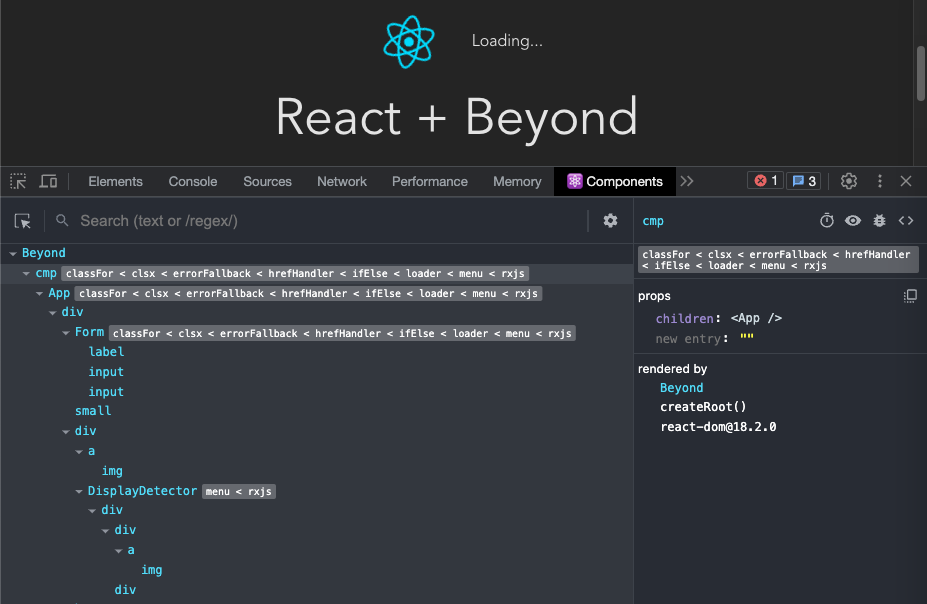

# FAQ

### What is React Beyond good for?

React is built around the idea of components being simple functions, so you can leverage the technique called 'higher-order functions' known from functional programming to create higher-order components (HOCs). A problem with simple HOCs is that they're only effective on a single component, so if you want a functionality, which is implemented with a HOC, to be applied to multiple components, you need to wrap each of them. This is where React Beyond comes in: it not only applies your HOC on a component, but all the components in the resulting JSX will be 'infected' as well. Your HOC will go beyond the component boundaries. This is actually a simple idea, and React Beyond is a small library!

### Doesn't it slow everything down?

Not at all. While it naturally has some overhead, the difference is negligable. Your app will keep the exact same performance characteristics.

### Doesn't it break Fast Refresh?

No. We have a Vite plugin that makes it work seamlessly. And adding support for other bundlers is easy.

### Does it work with SSR?

Yes.

### Does it work with React Server Components?

Not yet, but it might in the future. Technically, what we need here is to encode all the HOC information into props and then 'decode' them on the client side.

### Is it yet another directive library for React?

Much of the features in the Gallery are directives, but not exclusively. Directives are good, and there were many attempts in the ecosystem to recreate a similar functionality within React, but those libraries are flawed by relying on custom babel or bundler plugins, or if not, their API is cumbersome. 

### Is React Beyond totally plugin-free?

For its runtime working, yes. There is, however, a bundler plugin needed to make Hot Module Replacement work (just like React needs one). We provide a Vite plugin.

### Is React Beyond monkey-patching React or does it use private APIs?

No. React Beyond works with 100% pure public React usage. It's nothing else than higher-order components. There's one occasion in the Gallery (@react-beyond/rxjs) where the TypeScript typing uses a private interface to amend the React Children type, but that's it.

### Is it type-safe?

Directives are typed, yes, so Ctrl/Cmd + Click works just like on any other prop in your IDE.

### Doesn't it obfuscate the component inspector?

The components retain their displayname, and the applied features are shown next to them in application order:

